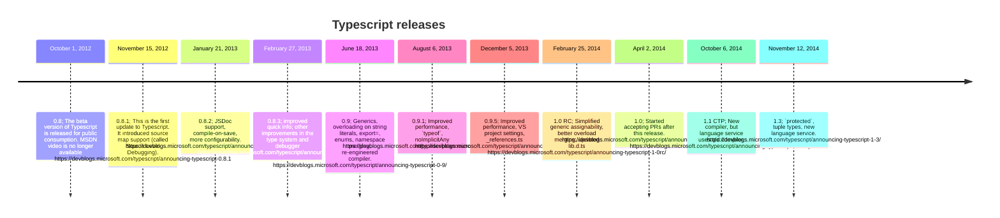

## Timeline of Typescript releases

```mermaid
timeline
    title Typescript releases
    October 1, 2012: 0.8; The beta version of Typescript is released for public consumption. MSDN video is no longer available
    November 15, 2012: 0.8.1; This is the first update to Typescript. It introduced source map support (called Source Level Debugging). https://devblogs.microsoft.com/typescript/announcing-typescript-0.8.1
    January 21, 2013: 0.8.2; JSDoc support, compile-on-save, more configurability. https://devblogs.microsoft.com/typescript/announcing-typescript-0-8-2/
    February 27, 2013: 0.8.3; improved quick info; other improvements in the type system and debugger https://devblogs.microsoft.com/typescript/announcing-typescript-0-8-3/
    June 18, 2013: 0.9; Generics, overloading on string literals, export=, enums, namespace merging, re-engineered compiler. https://devblogs.microsoft.com/typescript/announcing-typescript-0-9/
    August 6, 2013: 0.9.1; Improved performance, `typeof`, noImplicitAny https://devblogs.microsoft.com/typescript/announcing-typescript-0-9-1/
    December 5, 2013: 0.9.5; Improved performance, VS project settings, _references.ts https://devblogs.microsoft.com/typescript/announcing-typescript-0-9-5/
    February 25, 2014: 1.0 RC; Simplified generic assignability, better overload merging, updated lib.d.ts https://devblogs.microsoft.com/typescript/announcing-typescript-1-0rc/
    April 2, 2014: 1.0; Started accepting PRs after this release. https://devblogs.microsoft.com/typescript/announcing-typescript-1-0/
    October 6, 2014: 1.1 CTP; New compiler, but language service uses old compiler. https://devblogs.microsoft.com/typescript/announcing-typescript-1-1-ctp/
    November 12, 2014: 1.3; `protected`, tuple types, new language service. https://devblogs.microsoft.com/typescript/announcing-typescript-1-3/
```

## Timeline of Internal Typescript discussions

### Timeline of External Events Relevant to Typescript

