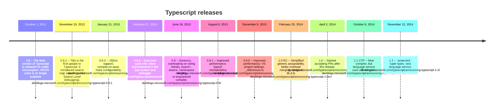

## Timeline of Typescript releases

<link title="timeline-styles" rel="stylesheet" 
              href="https://cdn.knightlab.com/libs/timeline3/latest/css/timeline.css">

## Timeline of Internal Typescript discussions

### Timeline of External Events Relevant to Typescript

